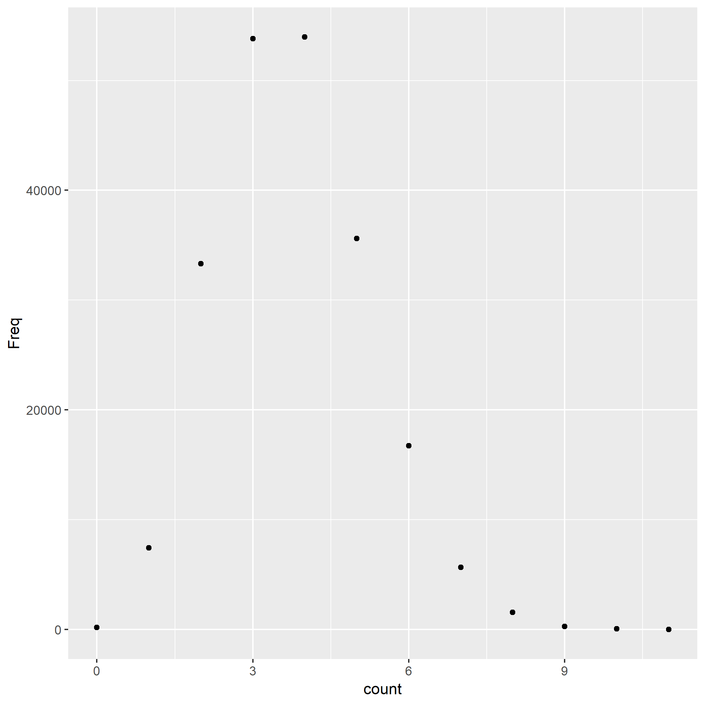

On most *nix systems, the file `/usr/share/dict/words` contains a bunch of words. On my machine, it contains 208576 words.

I counted the times of occurence of vowels in each word, and tabulated the frequency in a table.

The most frequent count is 4. On average, the number of vowels in a word is 3.7627723.

Here is a histogram of the occurence of vowels.

